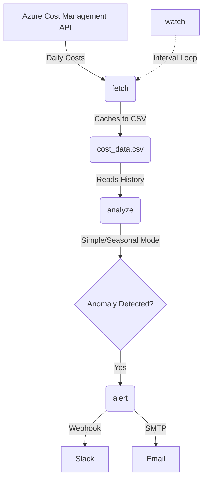

# Azure Cost Guard

> **Problem:** Cloud teams lose money to billing spikes caught too late. Azure Cost Guard detects unusual daily spending in your Azure subscription before the monthly bill arrives.

## Architecture



## Quick Demo

You can test the anomaly detection algorithms without connecting to Azure by running the built-in demo. This generates synthetic cost data with a simulated spike.

```bash
azure-cost-guard analyze --demo
```

**Output:**
```text
Running in DEMO mode with synthetic data...

Cost Trend:
...............+...........#..

                   Daily Azure Costs                   
+-----------------------------------------------------+
| Date       |    Cost | Expected |  Dev % | Severity |
|------------+---------+----------+--------+----------|
| 2026-08-05 |  $51.74 |   $51.74 |   0.0% | Normal   |
| 2026-08-06 |  $70.89 |   $70.89 |   0.0% | Normal   |
| 2026-08-07 |  $61.64 |   $61.64 |   0.0% | Normal   |
| 2026-08-08 |  $40.51 |   $61.42 | -34.0% | Normal   |
| 2026-08-09 |  $30.11 |   $56.19 | -46.4% | Normal   |
| 2026-08-10 |  $62.38 |   $50.98 |  22.4% | Normal   |
| 2026-08-11 |  $51.09 |   $52.88 |  -3.4% | Normal   |
| 2026-08-12 |  $62.03 |   $52.62 |  17.9% | Normal   |
| 2026-08-13 |  $66.14 |   $54.10 |  22.3% | Normal   |
| 2026-08-14 |  $58.06 |   $53.42 |   8.7% | Normal   |
| 2026-08-15 |  $31.46 |   $52.90 | -40.5% | Normal   |
| 2026-08-16 |  $39.60 |   $51.61 | -23.3% | Normal   |
| 2026-08-17 |  $60.01 |   $52.97 |  13.3% | Normal   |
| 2026-08-18 |  $55.23 |   $52.63 |   4.9% | Normal   |
| 2026-08-19 |  $57.33 |   $53.22 |   7.7% | Normal   |
| 2026-08-20 | $245.36 |   $52.55 | 367.0% | Severe   |
| 2026-08-21 |  $55.51 |   $78.15 | -29.0% | Normal   |
| 2026-08-22 |  $38.99 |   $77.78 | -49.9% | Normal   |
| 2026-08-23 |  $31.25 |   $78.86 | -60.4% | Normal   |
| 2026-08-24 |  $52.23 |   $77.67 | -32.8% | Normal   |
| 2026-08-25 |  $59.93 |   $76.56 | -21.7% | Normal   |
| 2026-08-26 |  $58.08 |   $77.23 | -24.8% | Normal   |
| 2026-08-27 |  $57.56 |   $77.33 | -25.6% | Normal   |
| 2026-08-28 |  $48.51 |   $50.51 |  -3.9% | Normal   |
| 2026-08-29 |  $40.74 |   $49.51 | -17.7% | Normal   |
| 2026-08-30 |  $43.78 |   $49.76 | -12.0% | Normal   |
| 2026-08-31 |  $50.61 |   $51.55 |  -1.8% | Normal   |
| 2026-09-01 | $316.72 |   $51.32 | 517.2% | Severe   |
| 2026-09-02 |  $67.00 |   $88.00 | -23.9% | Normal   |
| 2026-09-03 |  $55.59 |   $89.27 | -37.7% | Normal   |
+-----------------------------------------------------+
Severe anomalies detected!
```

## How Detection Works

Azure Cost Guard supports two modes for anomaly detection, both relying on statistical analysis to find outliers:

- **Simple Mode (Z-Score):** Calculates a rolling average of your costs over the past week and measures how much the current day's cost deviates using standard deviation (Z-score). If you normally spend $50/day and suddenly spend $250, the high Z-score flags it as an anomaly. *Best for consistent, stable daily costs.*
- **Seasonal Mode (STL Decomposition):** Cloud usage often drops on weekends and spikes on weekdays. STL (Seasonal and Trend decomposition using Loess) separates these weekly patterns from the underlying trend. By filtering out the expected weekend dip, it only looks for anomalies in the remaining "unexpected" cost variation. *Best for environments with strong weekly usage patterns.*

## Installation

Ensure you have Python 3.11+ installed.

```bash
git clone https://github.com/yourusername/azure-cost-guard.git
cd azure-cost-guard
pip install -e .
```

## Configuration

Initialize the configuration file:

```bash
azure-cost-guard init
```

This creates a `config.yaml` in your directory. Make sure you are authenticated with Azure using `DefaultAzureCredential` (e.g., `az login` or environment variables).

**Sample `config.yaml`:**
```yaml
azure_subscription_id: your-subscription-id
alert_threshold_k: 3.0
slack_webhook_url: https://hooks.slack.com/services/...
smtp_host: smtp.gmail.com
smtp_port: 587
smtp_user: user@example.com
smtp_password: ''
smtp_from: alerts@example.com
smtp_to: admin@example.com
watch_interval_minutes: 1440
```

## Usage

**Fetch Data:** (Downloads latest cost data)
```bash
azure-cost-guard fetch --days 30
```

**Analyze Data:** (Checks for anomalies)
```bash
azure-cost-guard analyze --mode simple
```

**Send Alerts:** (Triggers notifications if anomalies are found)
```bash
azure-cost-guard alert --mode seasonal
```

**Continuous Monitoring:** (Runs in an interval loop)
```bash
azure-cost-guard watch --mode seasonal
```

## Running Tests

To run the test suite, use pytest:

```bash
pytest
```

## Tech Stack
- Python 3.11+
- pandas & numpy (Data processing)
- statsmodels (STL decomposition)
- rich (Terminal UI)
- pytest (Testing)

## Roadmap

- [x] Synthetic data testing and core algorithm implementation
- [ ] **Pending:** Real-world testing against live Azure subscriptions
- [ ] Support for multiple subscriptions
- [ ] Additional alerting channels (e.g., Microsoft Teams)

## License
MIT License
